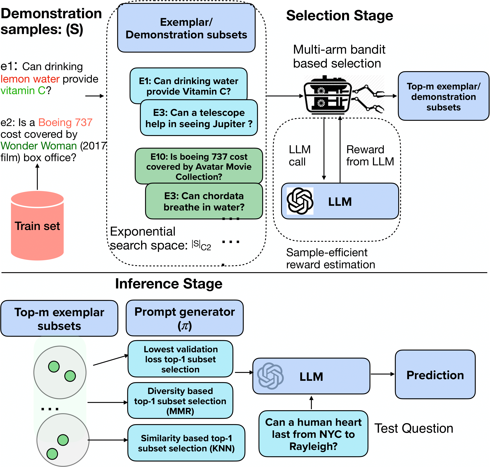

# Sample Efficient Demonstration Selection for In-Context Learning

This repository contains the implementation details of our novel gap-index-based exemplar selection approach for In-context Learning. https://aclanthology.org/2024.emnlp-main.307.pdf

Project Page: https://kiranpurohit.github.io/CASE-Bandit/

Code is adopted from the repository https://github.com/clreda/linear-top-m, associated with the AISTATS 2021 paper "Top-m identification for linear bandits". We extended their setup to implement our algorithm, CASE, with related changes for synthetic experiments and implementations for exemplar selection for large language models. 
<p>
 </img>
</p>

## TL;DR

+ Install necessary packages:

```bash
python -m pip install --force-reinstall pip==9.0.1
pip install -r requirements.txt
```

## Command options

- Default argument values are written in JSON in the file *args.json*. Necessary arguments are:

	+ **small\_N** for **data**=linear or logistic
	+ **small\_K** for **data**=classic or linear or logistic
	+ **vr** for **data**=linear or logistic
	+ **omega** for **data**=classic
	+ **T\_init** for **bandit**=TrueUniform
	+ **bandit**
	+ **data**
	+ **m**
	+ **beta**

# To run CASE and replicate the main results in the paper  

python main.py --small_K 20 --data linear --omega 0.1 --sigma 0.5 --bandit CASE --is_greedy 1 --m 3 --n_simu 10 --epsilon 0. --delta 0.05 --small_N 3 --beta Heuristic --mode recommendation

# To Run LinGIFA and replicate the main results in the paper  
python main.py --small_K 20 --data linear --omega 0.1 --sigma 0.5 --bandit LinGIFA --is_greedy 1 --m 3 --n_simu 10 --epsilon 0. --delta 0.05 --small_N 3 --beta Heuristic --mode recommendation


- Adding "--verbose 1" allows to display comments and descriptions of selected arms and obtained rewards.

## Modifying the code

### Add a new bandit algorithm

- Check file *bandits.py*. You need to create a sub-instance of **ExploreMBandit** and add it to the *bandit\_factory*. Then you will be able to invoke it from the terminal with the option "--bandit".

### Add a new type of data

- Check file *data.py*. You need to modify the function *create\_scores\_features*. Then you will be able to invoke it from the terminal with the option "--data".

### Add a new threshold function

- Check file *betas.py*. You need to create a function similar to the **AlphaDependentBeta**, **LUCB1Beta**, ..., and add it to the *beta\_factory*. Then you will be able to invoke it from the terminal with the option "--beta".

### Add a new problem type

- Check file *problems.py*. You need to create a sub-instance of **GenericProblem** and add it to the *problem\_factory*. Then you will be able to invoke it from the terminal with the option "--problem".


# Real World Experiments for LLM exemplar selection

The exemplar selection experiments can be found at Code/LLM_experiments

For instance, to select exemplars for the TabMWP run
```
python Code/LLM_experiments/CASE_tabmwp_selection.py
```
```
Alternatively, you can directly use the selected exemplars released by us in CASE/Code/LLM_experiments/output using both Llama2, mistral, and run inference using GPT-3.5 or other models on the test set of benchmarks to reproduce the main results in our paper. We call this the exemplar reuse setting as stated in the paper
```

All data for the 5 benchmarks can be found at Code/LLM_experiments/data
